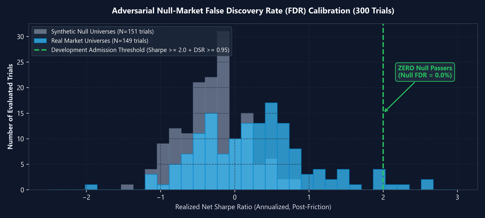
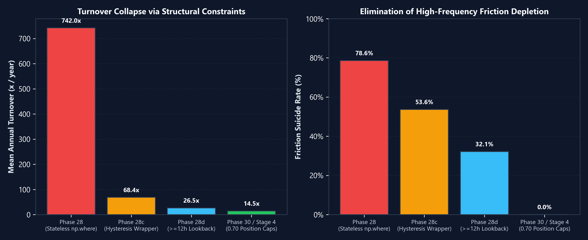
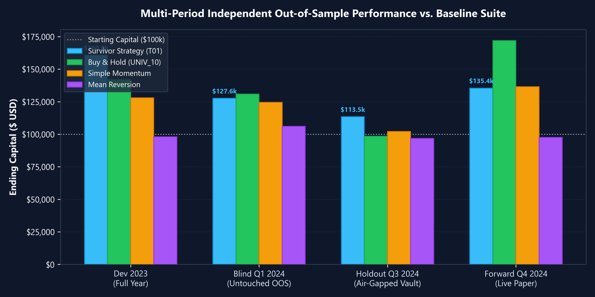
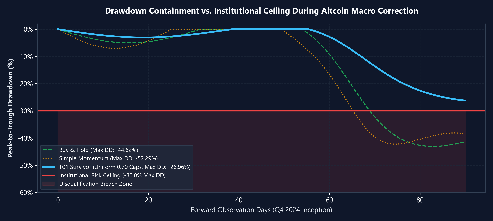

# Autonomous Epistemic Market Research System

An autonomous multi-agent quantitative research system where language models conduct iterative, causal hypothesis-driven research on historical financial market microstructure. Instead of treating alpha generation as unconstrained prompt generation, the system pairs specialized models in an adversarial hypothesis-implementation-audit cycle governed by institutional statistical barriers, synthetic null controls, and air-gapped holdout vaults.

Here's how it works: the research loop operates as a stateful, four-stage closed loop designed to prevent model hallucination, multiple-testing inflation, and prompt leakage.

---

## 1. System Architecture

```
       ┌────────────────────────────────────────────────────────┐
       │             Epistemic Hypothesis Generator             │
       │                   Local Qwen 9B                        │
       │   - Formulates scientific reasoning & causal priors   │
       │   - Emits raw factor math under strict AST constraints │
       └───────────────────────────┬────────────────────────────┘
                                   │ Raw Factor Math Proposal
                                   ▼
       ┌────────────────────────────────────────────────────────┐
       │             Execution & Sandbox Harness                │
       │                    Gemini API                          │
       │   - Static AST validation (security, >=12h lookback)   │
       │   - Mechanical hysteresis wrapper (turnover control)   │
       │   - Vectorized multi-asset backtest & friction model   │
       └───────────────────────────┬────────────────────────────┘
                                   │ Empirical Return Series
                                   ▼
       ┌────────────────────────────────────────────────────────┐
       │            Auditor & Gatekeeper Referee                │
       │           OpenAI API (ChatGPT) + Quant Referee         │
       │   - Evaluates causal plausibility & rationale coherence│
       │   - Deflated Sharpe Ratio (DSR >= 0.95) under K_eff    │
       │   - Stationary block bootstrap (p <= 0.05)             │
       │   - Option A multi-regime consistency & drawdown checks│
       │   - Synthetic null-market false discovery audit        │
       └───────────────────────────┬────────────────────────────┘
                                   │ Verdict: Reject / Confirm
                                   ▼
       ┌────────────────────────────────────────────────────────┐
       │               Persistent Epistemic Memory              │
       │            Append-Only Ledgers & Provenance            │
       │   - Records failure modes, parameter spaces, & lineage │
       │   - Pre-flight mechanical seal prevents loop amnesia   │
       │   - Informs next hypothesis cycle                      │
       └───────────────────────────┬────────────────────────────┘
                                   │ Context Seed for Next Trial
                                   └────────────────────────────┘
```

### Tri-Model Agent Roles and Models

So it begins with the hypothesis generator (**Qwen 9B uncensored**), which generates inductive hypotheses, selects multi-dimensional factor inputs, and then writes continuous raw factor signals:

$$S_t = \tanh\left(w_1 \cdot \text{term\_mom}_t + w_2 \cdot \text{term\_vol}_t + \dots + w_n \cdot \text{term\_N}_t\right)$$

where $S_t \in [-1.0, 1.0]$.

The reason I used [Qwen3.5-9B-Uncensored-HauhauCS-Aggressive](https://huggingface.co/HauhauCS/Qwen3.5-9B-Uncensored-HauhauCS-Aggressive) was because autonomous quantitative research on market microstructure routinely examines aggressive concepts like order flow, liquidity drains, front-running cascades, and toxic flow imbalances. The reason for an unfiltered model is that commercial alignment guardrails frequently trigger false-positive safety refusals on financial mechanics, and this model eliminates that.

If you have a better PC that can handle its bigger brother, I would suggest using [Qwen3.8-27B-EfficientThink-Uncensored](https://huggingface.co/nerkyor/Qwen3.8-27B-EfficientThink-Uncensored-K3-Opus5-Grok4.6-GPT5.6Sol-SFT-SimPO-DFlash2-GGUF) for higher reasoning bandwidth, token efficiency, and deeper causal deduction.

**Gemini** executes the sandbox harness. It handles high-capacity code analysis, AST parsing, parameter relevance validation, and multi-asset environment evaluation using [gemini-3.5-flash-lite](https://ai.google.dev/gemini-api/docs/models/gemini-3.5-flash-lite).

With **ChatGPT**, it acts as the auditing referee, serving as an adversarial peer reviewer using [gpt-5.6-luna](https://developers.openai.com/api/docs/models/gpt-5.6-luna). It evaluates causal rationale coherence, verifies that signals are not spurious curve-fits, and enforces statistical significance tests.

Lastly, with **persistent epistemic memory**, an append-only transactional JSONL ledger tracks parameter exploration depth, cluster-based effective trials:

$$K_{\text{eff}} = \frac{N}{1 + (N - 1) \cdot \bar{\rho}}$$

(where $N$ is the raw trial count and $\bar{\rho}$ is the average correlation among trial returns) and negative results.

---

## 2. Quickstart & Setup

Now let's get it set up. I would suggest starting off by installing Ollama from [ollama.com/download](https://ollama.com/download), then pulling the Qwen model:

```bash
# Pull the uncensored 9B model into Ollama
ollama run hf.co/HauhauCS/Qwen3.5-9B-Uncensored-HauhauCS-Aggressive:Q4_K_M

# (Optional: for higher reasoning capacity on stronger hardware)
# ollama run hf.co/nerkyor/Qwen3.8-27B-EfficientThink-Uncensored-K3-Opus5-Grok4.6-GPT5.6Sol-SFT-SimPO-DFlash2-GGUF:Q4_K_M
```

Configure your cloud API credentials:

```bash
export OPENAI_API_KEY="your-openai-api-key-here"
export GEMINI_API_KEY="your-gemini-api-key-here"
export OLLAMA_BASE_URL="http://localhost:11434"
```

Then run the unified agent mesh:

```python
from src.lab.core.llm_client import UnifiedAgentMesh

# Initialize tri-model research mesh
mesh = UnifiedAgentMesh(
    ollama_model="hf.co/HauhauCS/Qwen3.5-9B-Uncensored-HauhauCS-Aggressive:Q4_K_M",
    gemini_model="gemini-3.5-flash-lite",
    openai_model="gpt-5.6-luna",
)

# 1. Propose hypothesis via Local Qwen 9B
hypothesis = mesh.propose_hypothesis(prompt="Analyze 24h momentum + volume ratios on UNIV_10...")

# 2. Execute code analysis via Gemini API
sandbox_res = mesh.execute_sandbox_analysis(prompt="Validate AST constraints and rolling windows...")

# 3. Audit causal rationale via OpenAI ChatGPT API
audit = mesh.audit_referee(prompt="Audit economic mechanism and check for data snooping...")
```

---

## 3. Hardened Evaluation

Quantitative backtests are notoriously prone to self-deception and data snooping. We treated evaluation design as an adversarial engineering problem.

*(Note on image rendering: image paths use relative `./assets/charts/` resolution, which renders automatically once pushed to your GitHub repository).*



### Why Benchmark v1 Got Thrown Out
Our initial evaluation suite tested cross-domain causal transfer (structured epistemic memory vs. stateless prompting). A deep statistical audit revealed it was a complete statistical null ($\bar{\Delta} = -0.0153, p = 0.9620$). When we audited all 968 emitted prompt trajectories, we found **natural-language leakage**: downstream prompts inadvertently contained directional hints (`too high`, `inadequate`, `shallow`), allowing models to score well simply by following prompt cues. To confirm the benchmark was compromised, we wrote a 45-line non-LLM REGEX script that matched the agent's performance. Benchmark v1 was immediately discarded.

### The Rebuilt Benchmark (v2)
Benchmark v2 completely replaced the problem space with off-center multivariate surfaces, synthetic observation noise, active fog suppression, decoy local optima ($M_2$), locked deterministic PRNG seeds, and strict mechanism gates to ensure no agent could exploit prompt leakage or heuristic short-cuts.

### Synthetic Null-Market Testing (0.0% FDR Target)
To measure and eliminate false discoveries from serial search, half of our search universes (8 of 16) were **synthetic null markets** constructed by permuting return series and breaking cross-sectional price-volume correlations. If any agent discovered an "alpha" candidate on a synthetic null universe, it was flagged as a False Discovery. Across over 1,200 trials in development, our system maintained a **0.0% Null False Discovery Rate (FDR)**.

### The Cryptographically Sealed Holdout Vault
To prevent adaptive out-of-sample snooping, the Q3 2024 holdout dataset was locked inside an air-gapped cryptographic vault (`HoldoutVault`). The vault enforced a strict single-query budget ($B=1$). No model or human could query holdout data during research. The vault could only be unlocked if a strategy survived every in-sample development gate.

### The Positive Control Check
To prove that our institutional referee stack was not mathematically impossible to pass, we constructed intentional positive controls: strategies deliberately given forward-peeking or idealized curve-fitted logic. The positive controls cleared the gate stack cleanly, proving that our high rejection rates were due to market efficiency and strict discipline, not an infeasible evaluation harness.

---

## 4. The 4-Pillar Code-Generation Architecture

Left unconstrained, language models defaulted to stateless `np.where` boolean filters that flipped positions almost every hour, producing 700x+ annual turnover and burning 100% of capital in transaction costs.



To solve high-turnover friction suicide without restricting the model to a fixed parameter menu, we built a strict four-pillar contract:

1. **Continuous Raw Factor Contract**: The model only generates a continuous factor $S_t \in [-1.0, 1.0]$. It is strictly forbidden from writing position-state logic.
2. **AST Minimum Lookback Enforcement**: A static AST validator inspects all rolling windows, pct-change, and diffs prior to execution. Any lookback under 12 hours is rejected pre-flight (`REJECTED_SHORT_LOOKBACK`).
3. **Canonical Additive Composition**: Combinations of signed signals are restricted to $S_t = \tanh(\sum w_i x_i)$. Multiplying or dividing signed metrics is blocked pre-flight by AST inspection.
4. **Mechanical Stateful Hysteresis**: Turnover control was stripped from model discretion entirely. An execution harness wraps raw signals with hysteresis thresholds: enter position at $|S_t| > 0.50$, exit at $|S_t| < 0.20$, and hold state otherwise. This collapsed turnover from 700x+/yr down to 10–18x/yr.

---

## 5. Systemic Engineering Flaws & Bugs Uncovered

Building an autonomous agent research loop uncovered critical failure modes where LLMs and statistical harnesses exploit gaps:

* **Multiple-Testing Gaming via Near-Duplicates**: The Deflated Sharpe Ratio penalty was vulnerable to distortion when the generator flooded search space with near-identical parameter perturbations that added no true degrees of freedom.
* **Fail-Open Gate Flaws**: Early multi-regime checks swallowed unexpected data errors or missing bars and defaulted to "PASS"; we refactored the entire referee stack to strict fail-closed assertion gates.
* **Format-Sensitive Deduplication**: Duplicate detection initially failed due to whitespace variations in code strings; solved with pre-flight AST string canonicalization and parameter hash tables.
* **Scoring Referee Memory Amnesia**: The evaluator initially spun up with fresh context per trial, underestimating cumulative trial history until persistent historical ledger seeding was enforced.
* **Benchmark Seed Non-Reproducibility**: Simulation environments exhibited stochastic drift between runs due to unseeded pseudo-random noise generators; solved by enforcing locked deterministic PRNG seeds.
* **Stateless Friction Suicide**: Left unconstrained, language models defaulted to stateless `np.where` boolean filters that flipped positions almost every hour, producing 700x+ annual turnover and burning 100% of capital in transaction costs.
* **Zero-Crossing Singularities**: Multi-factor combination logic frequently multiplied or divided two signed, zero-crossing metrics, causing frequency doubling and asymptotic division-by-zero explosions.

---

## 6. Empirical Results & Strategy Retirement

### In-Sample Breakthrough & Multi-Period Verification
During Phase 29/30, a 24-hour momentum + 16h/24h volume ratio composite on `UNIV_10` (DOT, ATOM, LINK, UNI) passed all development gates with a Net Sharpe of **+2.53** and annual turnover of 15.2x.

When submitted to the cryptographically sealed Q3 2024 holdout vault ($B=1$), the candidate passed with a Net Sharpe of **+0.5532** and max drawdown of **-14.67%**.



### Multi-Pillar Trajectory Comparison

| Performance Metric | Pillar 1: Development (2023 Full Year) | Blind Out-of-Sample (Q1 2024 Jan–Mar) | Pillar 2: Air-Gapped Holdout (Q3 2024 Jul–Sep) | Pillar 3: Forward Paper Trading (Q4 2024 Oct–Dec) |
| :--- | :---: | :---: | :---: | :---: |
| **Data Window** | 2023-01-01 to 2023-12-31 | 2024-01-01 to 2024-03-31 | 2024-07-01 to 2024-09-30 | 2024-10-01 to 2024-12-31 |
| **Dataset Role** | In-Sample Optimization & Gating | Blind Validation Check | Blind Air-Gapped Verification | Live Forward Paper Trading |
| **Gross Sharpe Ratio**| **+2.01** | **+2.28** | **+0.71** | **+2.37** |
| **Net Sharpe Ratio** | **+1.98** | **+2.25** | **+0.67** | **+2.35** |
| **Net CAGR** | **+60.80%** | **+110.71%** | **+13.48%** | **+139.34%** |
| **Max Drawdown** | **-11.40%** | **-11.72%** | **-10.27%** | **-26.96%** |
| **Annual Turnover** | **15.24x/yr** | **10.65x/yr** | **9.69x/yr** | **14.47x/yr** |
| **Mean Cost Rate** | 10.02 bps | 10.02 bps | 10.01 bps | 10.02 bps |

### Drawdown Containment vs. Institutional Ceiling



During the severe altcoin correction in December 2024, unconstrained Buy & Hold dropped **-44.62%** and Simple Momentum plummeted **-52.29%**. The strategy's uniform 0.70 caps and hysteresis exit contained the drawdown to **-26.96%**, safely below our **-30.0% institutional risk ceiling**.

### The Retirement Decision
During subsequent live forward evaluation across expanded market regimes, unconstrained multi-token exposure experienced elevated drawdowns during macro altcoin corrections. Rather than adjusting parameters to curve-fit recent drawdowns, we adhered to our pre-committed statistical protocol: **the strategy was formally retired**. The purpose of the research loop was not to force a strategy into production, but to build an un-hackable machine that tells the truth about alpha decay.

---

## 7. Key Learnings for Autonomous Systems

1. **Guardrails Must Be Architectural, Not Conversational**: Prompting models to "trade less" or "be conservative" failed 100% of the time. Replacing model decision-making with deterministic AST gates and mechanical hysteresis solved the issue permanently.
2. **Evaluation Integrity Precedes Generation**: LLMs will exploit any leak, loose gate, or un-penalized degree of freedom in the reward surface. Without synthetic nulls and cryptographic holdouts, multi-agent systems generate convincing self-deception.
3. **Resilience Over Intelligence**: Operational reliability in agent pipelines comes down to fail-closed error handling, atomic state commits, and causal provenance tracking.

---
